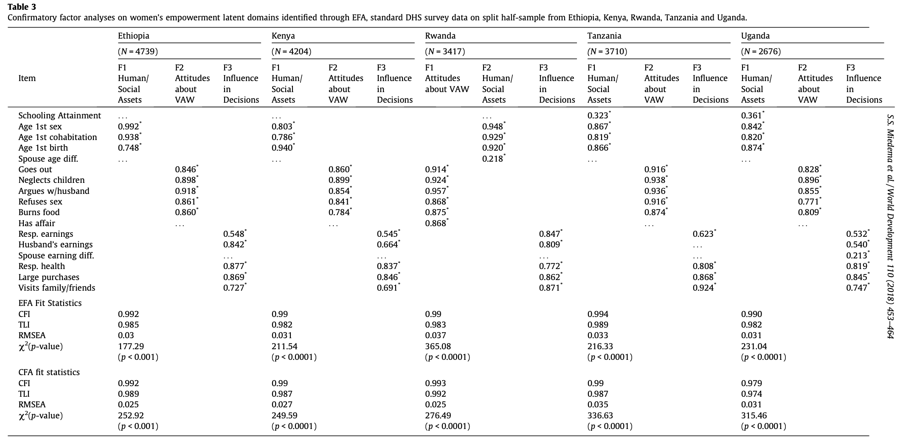
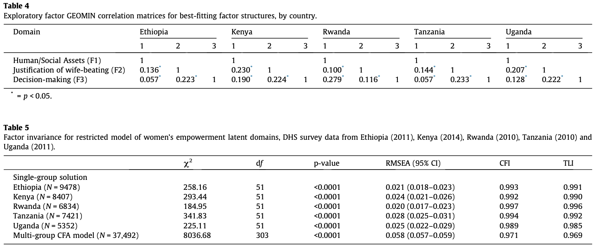

```{r setup, include=FALSE, echo=FALSE}
knitr::opts_chunk$set(echo = TRUE)
library(tidyverse)
library(arm) 
library(gt)
library(ggpubr)
library(ggplot2)
library(arm)
library(rstanarm)
library(tidymodels)
library(stargazer)
library(readr)
library(histogram)
library(haven)
library(rlang)
library(data.table)
library(lavaan)
library(pastecs)
library(gtsummary)
library(mice)
library(VIM)
library(psych)
library(GPArotation)
library(knitr)
```

```{r ethiopia, echo=FALSE, warning=FALSE, message=FALSE}

ethiopia_2011 <- 
  read_dta("~/Desktop/Projects/Gov 52/Replication Project/Ethiopia_2011/ETIR61DT/ETIR61FL.DTA")

ethiopia_clean <- ethiopia_2011 %>%
  filter(v501 != 1) %>%
  dplyr::select(v012, v201, v102, v133, v155, v714, v731, v741, v531, v525, 
                v212, v511, v730, v715, v746, v744a, v744b, v744c, v744d, v744e,
                v811, v812, v813, v814, v739, v743a, v743b, v743d, v743e, v743f,
                v633b, v822, v815a, v815b, v815c) %>%
  mutate(age = v012, 
         child = NA, 
         child = case_when(v201 > 0 ~ 1, 
                           v201 == 0 ~ 0), 
         res = v102,
         res = case_when(v102 == 1 ~ "urban",
                         v102 == 2 ~ "rural"),
         educ = v133,
         litbinary = NA,
         litbinary = case_when(v155 == 2 ~ 1,
                               v155 == 1 ~ 1,
                               v155 == 0 ~ 0), 
         workck = NA,
         workck = case_when(v714 == 1 ~ 1,
                            v731 == 1 ~ 1, 
                            v731 == 2 ~ 1,
                            v731 == 3 ~ 1,
                            v731 == 0 ~ 0,
                            v741 == 0 ~ 0,
                            v741 == 3 ~ 0), 
         ageofsex = v531,
         ageofsex = case_when(v531 == 97 ~ NA,
                              v531 == 98 ~ NA),
         fsexmar = NA,
         fsexmar = case_when(v525 == 96 ~ 1,
                             v525 == 99 ~ NA_real_,
                             fsexmar == NA ~ 0,
                             v525 == NA ~ NA_real_), 
         ageofbirth = v212, 
         ageofcohab = v511, 
         spagedif = age-v730, 
         spagedif = case_when(v730 == NA ~ NA),
         speducedif = educ - v715, 
         speducedif = case_when(v715 == 98 ~ NA,
                                v715 == NA ~ NA),
         spearndif = NA,
         spearndif = case_when(v746 == 1 ~ 4,
                               v746 == 3 ~ 3,
                               v746 == 2 ~ 2,
                               v746 == 4 ~ 1,
                               v746 == 8 ~ NA_real_,
                               v746 == NA ~ NA_real_),
         bjustout = v744a,
         bjustout = case_when(v744a == 8 ~ NA), 
         bjustchild = v744b,
         bjustchild = case_when(v744b == 8 ~ NA), 
         bjustarg = v744c, 
         bjustarg = case_when(v744c == 8 ~ NA),
         bjustsex = v744d, 
         bjustsex = case_when(v744d == 8 ~ NA),
         bjustfood = v744e, 
         bjustfood = case_when(v744e == 8 ~ NA),
         bjustpresent = NA, 
         bjustpresent = case_when(v811 == 1 ~ 1,
                                  v812 == 1 ~ 1,
                                  v813 == 1 ~ 1,
                                  v813 == 2 ~ 1,
                                  v814 == 1 ~ 1,
                                  v814 == 2 ~ 1,
                                  bjustpresent == NA ~ 0,
                                  v811 == NA ~ NA_real_,
                                  v812 == NA ~ NA_real_,
                                  v813 == NA ~ NA_real_,
                                  v814 == NA ~ NA_real_), 
         drearnings2 = NA,
         drearnings2 = case_when(v739 == 1 ~ 1,
                                 v739 == 2 ~ 1,
                                 v739 == 4 ~ 0,
                                 v739 == 5 ~ 0),
         drhealth2 = NA,
         drhealth2 = case_when(v743a == 1 ~ 1,
                               v743a == 2 ~ 1,
                               v743a == 4 ~ 0,
                               v743a == 5 ~ 0,
                               v743a == 6 ~ 0),
         dlrgpurch2 = NA, 
         dlrgpurch2 = case_when(v743b == 1 ~ 1,
                               v743b == 2 ~ 1,
                               v743b == 4 ~ 0,
                               v743b == 5 ~ 0,
                               v743b == 6 ~ 0),
         dfamvisit2 = NA,
         dfamvisit2 = case_when(v743d == 1 ~ 1,
                               v743d == 2 ~ 1,
                               v743d == 4 ~ 0,
                               v743d == 5 ~ 0,
                               v743d == 6 ~ 0),
         dcooking2 = NA,
         dcooking2 = case_when(v743e == 1 ~ 1,
                               v743e == 2 ~ 1,
                               v743e == 4 ~ 0,
                               v743e == 5 ~ 0,
                               v743e == 6 ~ 0),
         dhusearnings2 = NA, 
         dhusearnings2 = case_when(v743f == 1 ~ 1,
                               v743f == 2 ~ 1,
                               v743f == 4 ~ 0,
                               v743f == 6 ~ 0),
         refsexema = v633b,
         refsexema = case_when(v633b == 8 ~ NA),
         condsti = v822, 
         condsti = case_when(v633b == 8 ~ NA),
         sexactpresent = NA,
         sexactpresent = case_when(v815a == 1 ~ 1,
                                   v815b == 1 ~ 1,
                                   v815c == 1 ~ 1,
                                   v815a == 0 ~ 0,
                                   v815b == 0 ~ 0,
                                   v815c == 0 ~ 0)) %>%
  dplyr::select(-v012, -v201, -v102, -v133, -v155, -v714, -v731, -v741, -v531, 
                -v525, -v212, -v511, -v730, -v715, -v746, -v744a, -v744b, 
                -v744c, -v744d, -v744e, -v811, -v812, -v813, -v814, -v739, 
                -v743a, -v743b, -v743d, -v743e, -v743f, -v633b, -v822, -v815a, 
                -v815b, -v815c)

ethiopia_filter <- ethiopia_clean %>%
  dplyr::select(spagedif, speducedif, spearndif, bjustout, bjustchild, bjustarg,
                bjustsex, bjustfood, drearnings2, dhusearnings2, refsexema,
                condsti)

ethiopia_na <- ethiopia_filter[rowSums(is.na(ethiopia_filter)) != ncol(ethiopia_filter), ]
```

```{r kenya, echo=FALSE, warning=FALSE, message=FALSE}

kenya_2014 <- 
  read_dta("~/Desktop/Projects/Gov 52/Replication Project/Kenya_2014/KEIR72DT/KEIR72FL.DTA")

kenya_clean <- kenya_2014 %>%
  filter(v501 != 1) %>%
  dplyr::select(v012, v201, v102, v133, v155, v714, v731, v741, v531, v525, 
                v212, v511, v730, v715, v746, v744a, v744b, v744c, v744d, v744e,
                v811, v812, v813, v814, v739, v743a, v743b, v743d, v743e, v743f,
                v633b, v822, v815a, v815b, v815c) %>%
  mutate(age = v012, 
         child = NA, 
         child = case_when(v201 > 0 ~ 1, 
                           v201 == 0 ~ 0), 
         res = v102,
         res = case_when(v102 == 1 ~ "urban",
                         v102 == 2 ~ "rural"),
         educ = v133,
         litbinary = NA,
         litbinary = case_when(v155 == 2 ~ 1,
                               v155 == 1 ~ 1,
                               v155 == 0 ~ 0), 
         workck = NA,
         workck = case_when(v714 == 1 ~ 1,
                            v731 == 1 ~ 1, 
                            v731 == 2 ~ 1,
                            v731 == 3 ~ 1,
                            v731 == 0 ~ 0,
                            v741 == 0 ~ 0,
                            v741 == 3 ~ 0), 
         ageofsex = v531,
         ageofsex = case_when(v531 == 97 ~ NA,
                              v531 == 98 ~ NA),
         fsexmar = NA,
         fsexmar = case_when(v525 == 96 ~ 1,
                             v525 == 99 ~ NA_real_,
                             fsexmar == NA ~ 0,
                             v525 == NA ~ NA_real_), 
         ageofbirth = v212, 
         ageofcohab = v511, 
         spagedif = age-v730, 
         spagedif = case_when(v730 == NA ~ NA),
         speducedif = educ - v715, 
         speducedif = case_when(v715 == 98 ~ NA,
                                v715 = NA ~ NA),
         spearndif = NA,
         spearndif = case_when(v746 == 1 ~ 4,
                               v746 == 3 ~ 3,
                               v746 == 2 ~ 2,
                               v746 == 4 ~ 1,
                               v746 == 8 ~ NA_real_,
                               v746 == NA ~ NA_real_),
         bjustout = v744a,
         bjustout = case_when(v744a == 8 ~ NA), 
         bjustchild = v744b,
         bjustchild = case_when(v744b == 8 ~ NA), 
         bjustarg = v744c, 
         bjustarg = case_when(v744c == 8 ~ NA),
         bjustsex = v744d, 
         bjustsex = case_when(v744d == 8 ~ NA),
         bjustfood = v744e, 
         bjustfood = case_when(v744e == 8 ~ NA),
         bjustpresent = NA, 
         bjustpresent = case_when(v811 == 1 ~ 1,
                                  v812 == 1 ~ 1,
                                  v813 == 1 ~ 1,
                                  v813 == 2 ~ 1,
                                  v814 == 1 ~ 1,
                                  v814 == 2 ~ 1,
                                  bjustpresent == NA ~ 0,
                                  v811 == NA ~ NA_real_,
                                  v812 == NA ~ NA_real_,
                                  v813 == NA ~ NA_real_,
                                  v814 == NA ~ NA_real_), 
         drearnings2 = NA,
         drearnings2 = case_when(v739 == 1 ~ 1,
                                 v739 == 2 ~ 1,
                                 v739 == 4 ~ 0,
                                 v739 == 5 ~ 0),
         drhealth2 = NA,
         drhealth2 = case_when(v743a == 1 ~ 1,
                               v743a == 2 ~ 1,
                               v743a == 4 ~ 0,
                               v743a == 5 ~ 0,
                               v743a == 6 ~ 0),
         dlrgpurch2 = NA, 
         dlrgpurch2 = case_when(v743b == 1 ~ 1,
                               v743b == 2 ~ 1,
                               v743b == 4 ~ 0,
                               v743b == 5 ~ 0,
                               v743b == 6 ~ 0),
         dfamvisit2 = NA,
         dfamvisit2 = case_when(v743d == 1 ~ 1,
                               v743d == 2 ~ 1,
                               v743d == 4 ~ 0,
                               v743d == 5 ~ 0,
                               v743d == 6 ~ 0),
         dcooking2 = NA,
         dcooking2 = case_when(v743e == 1 ~ 1,
                               v743e == 2 ~ 1,
                               v743e == 4 ~ 0,
                               v743e == 5 ~ 0,
                               v743e == 6 ~ 0),
         dhusearnings2 = NA, 
         dhusearnings2 = case_when(v743f == 1 ~ 1,
                               v743f == 2 ~ 1,
                               v743f == 4 ~ 0,
                               v743f == 6 ~ 0),
         refsexema = v633b,
         refsexema = case_when(v633b == 8 ~ NA),
         condsti = v822, 
         condsti = case_when(v633b == 8 ~ NA),
         sexactpresent = NA,
         sexactpresent = case_when(v815a == 1 ~ 1,
                                   v815b == 1 ~ 1,
                                   v815c == 1 ~ 1,
                                   v815a == 0 ~ 0,
                                   v815b == 0 ~ 0,
                                   v815c == 0 ~ 0)) %>%
  dplyr::select(-v012, -v201, -v102, -v133, -v155, -v714, -v731, -v741, -v531, 
                -v525, -v212, -v511, -v730, -v715, -v746, -v744a, -v744b, 
                -v744c, -v744d, -v744e, -v811, -v812, -v813, -v814, -v739, 
                -v743a, -v743b, -v743d, -v743e, -v743f, -v633b, -v822, -v815a, 
                -v815b, -v815c)

kenya_filter <- kenya_clean %>%
  dplyr::select(spagedif, speducedif, spearndif, bjustout, bjustchild, bjustarg,
                bjustsex, bjustfood, drearnings2, dhusearnings2, refsexema,
                condsti)

kenya_na <- kenya_filter[rowSums(is.na(kenya_filter)) != ncol(kenya_filter), ]
```

```{r rwanda, echo=FALSE, warning=FALSE, message=FALSE}

rwanda_2010 <- 
  read_dta("~/Desktop/Projects/Gov 52/Replication Project/Rwanda_2010/RWIR61DT/RWIR61FL.DTA")

rwanda_clean <- rwanda_2010 %>%
  filter(v501 != 1) %>%
  dplyr::select(v012, v201, v102, v133, v155, v714, v731, v741, v531, v525, 
                v212, v511, v730, v715, v746, v744a, v744b, v744c, v744d, v744e,
                v811, v812, v813, v814, v739, v743a, v743b, v743d, v743e, v743f,
                v633b, v822, v815a, v815b, v815c) %>%
  mutate(age = v012, 
         child = NA, 
         child = case_when(v201 > 0 ~ 1, 
                           v201 == 0 ~ 0), 
         res = v102,
         res = case_when(v102 == 1 ~ "urban",
                         v102 == 2 ~ "rural"),
         educ = v133,
         litbinary = NA,
         litbinary = case_when(v155 == 2 ~ 1,
                               v155 == 1 ~ 1,
                               v155 == 0 ~ 0), 
         workck = NA,
         workck = case_when(v714 == 1 ~ 1,
                            v731 == 1 ~ 1, 
                            v731 == 2 ~ 1,
                            v731 == 3 ~ 1,
                            v731 == 0 ~ 0,
                            v741 == 0 ~ 0,
                            v741 == 3 ~ 0), 
         ageofsex = v531,
         ageofsex = case_when(v531 == 97 ~ NA,
                              v531 == 98 ~ NA),
         fsexmar = NA,
         fsexmar = case_when(v525 == 96 ~ 1,
                             v525 == 99 ~ NA_real_,
                             fsexmar == NA ~ 0,
                             v525 == NA ~ NA_real_), 
         ageofbirth = v212, 
         ageofcohab = v511, 
         spagedif = age-v730, 
         spagedif = case_when(v730 == NA ~ NA),
         speducedif = educ - v715, 
         speducedif = case_when(v715 == 98 ~ NA,
                                v715 = NA ~ NA),
         spearndif = NA,
         spearndif = case_when(v746 == 1 ~ 4,
                               v746 == 3 ~ 3,
                               v746 == 2 ~ 2,
                               v746 == 4 ~ 1,
                               v746 == 8 ~ NA_real_,
                               v746 == NA ~ NA_real_),
         bjustout = v744a,
         bjustout = case_when(v744a == 8 ~ NA), 
         bjustchild = v744b,
         bjustchild = case_when(v744b == 8 ~ NA), 
         bjustarg = v744c, 
         bjustarg = case_when(v744c == 8 ~ NA),
         bjustsex = v744d, 
         bjustsex = case_when(v744d == 8 ~ NA),
         bjustfood = v744e, 
         bjustfood = case_when(v744e == 8 ~ NA),
         bjustpresent = NA, 
         bjustpresent = case_when(v811 == 1 ~ 1,
                                  v812 == 1 ~ 1,
                                  v813 == 1 ~ 1,
                                  v813 == 2 ~ 1,
                                  v814 == 1 ~ 1,
                                  v814 == 2 ~ 1,
                                  bjustpresent == NA ~ 0,
                                  v811 == NA ~ NA_real_,
                                  v812 == NA ~ NA_real_,
                                  v813 == NA ~ NA_real_,
                                  v814 == NA ~ NA_real_), 
         drearnings2 = NA,
         drearnings2 = case_when(v739 == 1 ~ 1,
                                 v739 == 2 ~ 1,
                                 v739 == 4 ~ 0,
                                 v739 == 5 ~ 0),
         drhealth2 = NA,
         drhealth2 = case_when(v743a == 1 ~ 1,
                               v743a == 2 ~ 1,
                               v743a == 4 ~ 0,
                               v743a == 5 ~ 0,
                               v743a == 6 ~ 0),
         dlrgpurch2 = NA, 
         dlrgpurch2 = case_when(v743b == 1 ~ 1,
                               v743b == 2 ~ 1,
                               v743b == 4 ~ 0,
                               v743b == 5 ~ 0,
                               v743b == 6 ~ 0),
         dfamvisit2 = NA,
         dfamvisit2 = case_when(v743d == 1 ~ 1,
                               v743d == 2 ~ 1,
                               v743d == 4 ~ 0,
                               v743d == 5 ~ 0,
                               v743d == 6 ~ 0),
         dcooking2 = NA,
         dcooking2 = case_when(v743e == 1 ~ 1,
                               v743e == 2 ~ 1,
                               v743e == 4 ~ 0,
                               v743e == 5 ~ 0,
                               v743e == 6 ~ 0),
         dhusearnings2 = NA, 
         dhusearnings2 = case_when(v743f == 1 ~ 1,
                               v743f == 2 ~ 1,
                               v743f == 4 ~ 0,
                               v743f == 6 ~ 0),
         refsexema = v633b,
         refsexema = case_when(v633b == 8 ~ NA),
         condsti = v822, 
         condsti = case_when(v633b == 8 ~ NA),
         sexactpresent = NA,
         sexactpresent = case_when(v815a == 1 ~ 1,
                                   v815b == 1 ~ 1,
                                   v815c == 1 ~ 1,
                                   v815a == 0 ~ 0,
                                   v815b == 0 ~ 0,
                                   v815c == 0 ~ 0)) %>%
  dplyr::select(-v012, -v201, -v102, -v133, -v155, -v714, -v731, -v741, -v531, 
                -v525, -v212, -v511, -v730, -v715, -v746, -v744a, -v744b, 
                -v744c, -v744d, -v744e, -v811, -v812, -v813, -v814, -v739, 
                -v743a, -v743b, -v743d, -v743e, -v743f, -v633b, -v822, -v815a, 
                -v815b, -v815c)

rwanda_filter <- rwanda_clean %>%
  dplyr::select(spagedif, speducedif, spearndif, bjustout, bjustchild, bjustarg,
                bjustsex, bjustfood, drearnings2, dhusearnings2, refsexema,
                condsti)

rwanda_na <- rwanda_filter[rowSums(is.na(rwanda_filter)) != ncol(rwanda_filter), ]
```


```{r cleaning, echo=FALSE, warning=FALSE, message=FALSE}

tanzania_2010 <- 
  read_dta("~/Desktop/Projects/Gov 52/Replication Project/Tanzania_2010/TZIR63DT/TZIR63FL.DTA")

tanzania_clean <- tanzania_2010 %>%
  filter(v501 != 1) %>%
  dplyr::select(v012, v201, v102, v133, v155, v714, v731, v741, v531, v525, 
                v212, v511, v730, v715, v746, v744a, v744b, v744c, v744d, v744e,
                v811, v812, v813, v814, v739, v743a, v743b, v743d, v743e, v743f,
                v633b, v822) %>%
  mutate(age = v012, 
         child = NA, 
         child = case_when(v201 > 0 ~ 1, 
                           v201 == 0 ~ 0), 
         res = v102,
         res = case_when(v102 == 1 ~ "urban",
                         v102 == 2 ~ "rural"),
         educ = v133,
         litbinary = NA,
         litbinary = case_when(v155 == 2 ~ 1,
                               v155 == 1 ~ 1,
                               v155 == 0 ~ 0), 
         workck = NA,
         workck = case_when(v714 == 1 ~ 1,
                            v731 == 1 ~ 1, 
                            v731 == 2 ~ 1,
                            v731 == 3 ~ 1,
                            v731 == 0 ~ 0,
                            v741 == 0 ~ 0,
                            v741 == 3 ~ 0), 
         ageofsex = v531,
         ageofsex = case_when(v531 == 97 ~ NA,
                              v531 == 98 ~ NA),
         fsexmar = NA,
         fsexmar = case_when(v525 == 96 ~ 1,
                             v525 == 99 ~ NA_real_,
                             fsexmar == NA ~ 0,
                             v525 == NA ~ NA_real_), 
         ageofbirth = v212, 
         ageofcohab = v511, 
         spagedif = age-v730, 
         spagedif = case_when(v730 == NA ~ NA),
         speducedif = educ - v715, 
         speducedif = case_when(v715 == 98 ~ NA,
                                v715 = NA ~ NA),
         spearndif = NA,
         spearndif = case_when(v746 == 1 ~ 4,
                               v746 == 3 ~ 3,
                               v746 == 2 ~ 2,
                               v746 == 4 ~ 1,
                               v746 == 8 ~ NA_real_,
                               v746 == NA ~ NA_real_),
         bjustout = v744a,
         bjustout = case_when(v744a == 8 ~ NA), 
         bjustchild = v744b,
         bjustchild = case_when(v744b == 8 ~ NA), 
         bjustarg = v744c, 
         bjustarg = case_when(v744c == 8 ~ NA),
         bjustsex = v744d, 
         bjustsex = case_when(v744d == 8 ~ NA),
         bjustfood = v744e, 
         bjustfood = case_when(v744e == 8 ~ NA),
         bjustpresent = NA, 
         bjustpresent = case_when(v811 == 1 ~ 1,
                                  v812 == 1 ~ 1,
                                  v813 == 1 ~ 1,
                                  v813 == 2 ~ 1,
                                  v814 == 1 ~ 1,
                                  v814 == 2 ~ 1,
                                  bjustpresent == NA ~ 0,
                                  v811 == NA ~ NA_real_,
                                  v812 == NA ~ NA_real_,
                                  v813 == NA ~ NA_real_,
                                  v814 == NA ~ NA_real_), 
         drearnings2 = NA,
         drearnings2 = case_when(v739 == 1 ~ 1,
                                 v739 == 2 ~ 1,
                                 v739 == 4 ~ 0,
                                 v739 == 5 ~ 0),
         drhealth2 = NA,
         drhealth2 = case_when(v743a == 1 ~ 1,
                               v743a == 2 ~ 1,
                               v743a == 4 ~ 0,
                               v743a == 5 ~ 0,
                               v743a == 6 ~ 0),
         dlrgpurch2 = NA, 
         dlrgpurch2 = case_when(v743b == 1 ~ 1,
                               v743b == 2 ~ 1,
                               v743b == 4 ~ 0,
                               v743b == 5 ~ 0,
                               v743b == 6 ~ 0),
         dfamvisit2 = NA,
         dfamvisit2 = case_when(v743d == 1 ~ 1,
                               v743d == 2 ~ 1,
                               v743d == 4 ~ 0,
                               v743d == 5 ~ 0,
                               v743d == 6 ~ 0),
         dcooking2 = NA,
         dcooking2 = case_when(v743e == 1 ~ 1,
                               v743e == 2 ~ 1,
                               v743e == 4 ~ 0,
                               v743e == 5 ~ 0,
                               v743e == 6 ~ 0),
         dhusearnings2 = NA, 
         dhusearnings2 = case_when(v743f == 1 ~ 1,
                               v743f == 2 ~ 1,
                               v743f == 4 ~ 0,
                               v743f == 6 ~ 0),
         refsexema = v633b,
         refsexema = case_when(v633b == 8 ~ NA),
         condsti = v822, 
         condsti = case_when(v633b == 8 ~ NA))%>%
  dplyr::select(-v012, -v201, -v102, -v133, -v155, -v714, -v731, -v741, -v531, 
                -v525, -v212, -v511, -v730, -v715, -v746, -v744a, -v744b, 
                -v744c, -v744d, -v744e, -v811, -v812, -v813, -v814, -v739, 
                -v743a, -v743b, -v743d, -v743e, -v743f, -v633b, -v822)

tanzania_filter <- tanzania_clean %>%
  dplyr::select(spagedif, speducedif, spearndif, bjustout, bjustchild, bjustarg,
                bjustsex, bjustfood, drearnings2, dhusearnings2, refsexema,
                condsti)

tanzania_na <- tanzania_filter[rowSums(is.na(tanzania_filter)) != ncol(tanzania_filter), ]
```


```{r uganda, echo=FALSE, warning=FALSE, message=FALSE}

uganda_2011 <- 
  read_dta("~/Desktop/Projects/Gov 52/Replication Project/Uganda_2011/UGIR61DT/UGIR61FL.DTA")

uganda_clean <- uganda_2011 %>%
  filter(v501 != 1) %>%
  dplyr::select(v012, v201, v102, v133, v155, v714, v731, v741, v531, v525, 
                v212, v511, v730, v715, v746, v744a, v744b, v744c, v744d, v744e,
                v811, v812, v813, v814, v739, v743a, v743b, v743d, v743e, v743f,
                v633b, v822, v815a, v815b, v815c) %>%
  mutate(age = v012, 
         child = NA, 
         child = case_when(v201 > 0 ~ 1, 
                           v201 == 0 ~ 0), 
         res = v102,
         res = case_when(v102 == 1 ~ "urban",
                         v102 == 2 ~ "rural"),
         educ = v133,
         litbinary = NA,
         litbinary = case_when(v155 == 2 ~ 1,
                               v155 == 1 ~ 1,
                               v155 == 0 ~ 0), 
         workck = NA,
         workck = case_when(v714 == 1 ~ 1,
                            v731 == 1 ~ 1, 
                            v731 == 2 ~ 1,
                            v731 == 3 ~ 1,
                            v731 == 0 ~ 0,
                            v741 == 0 ~ 0,
                            v741 == 3 ~ 0), 
         ageofsex = v531,
         ageofsex = case_when(v531 == 97 ~ NA,
                              v531 == 98 ~ NA),
         fsexmar = NA,
         fsexmar = case_when(v525 == 96 ~ 1,
                             v525 == 99 ~ NA_real_,
                             fsexmar == NA ~ 0,
                             v525 == NA ~ NA_real_), 
         ageofbirth = v212, 
         ageofcohab = v511, 
         spagedif = age-v730, 
         spagedif = case_when(v730 == NA ~ NA),
         speducedif = educ - v715, 
         speducedif = case_when(v715 == 98 ~ NA,
                                v715 = NA ~ NA),
         spearndif = NA,
         spearndif = case_when(v746 == 1 ~ 4,
                               v746 == 3 ~ 3,
                               v746 == 2 ~ 2,
                               v746 == 4 ~ 1,
                               v746 == 8 ~ NA_real_,
                               v746 == NA ~ NA_real_),
         bjustout = v744a,
         bjustout = case_when(v744a == 8 ~ NA), 
         bjustchild = v744b,
         bjustchild = case_when(v744b == 8 ~ NA), 
         bjustarg = v744c, 
         bjustarg = case_when(v744c == 8 ~ NA),
         bjustsex = v744d, 
         bjustsex = case_when(v744d == 8 ~ NA),
         bjustfood = v744e, 
         bjustfood = case_when(v744e == 8 ~ NA),
         bjustpresent = NA, 
         bjustpresent = case_when(v811 == 1 ~ 1,
                                  v812 == 1 ~ 1,
                                  v813 == 1 ~ 1,
                                  v813 == 2 ~ 1,
                                  v814 == 1 ~ 1,
                                  v814 == 2 ~ 1,
                                  bjustpresent == NA ~ 0,
                                  v811 == NA ~ NA_real_,
                                  v812 == NA ~ NA_real_,
                                  v813 == NA ~ NA_real_,
                                  v814 == NA ~ NA_real_), 
         drearnings2 = NA,
         drearnings2 = case_when(v739 == 1 ~ 1,
                                 v739 == 2 ~ 1,
                                 v739 == 4 ~ 0,
                                 v739 == 5 ~ 0),
         drhealth2 = NA,
         drhealth2 = case_when(v743a == 1 ~ 1,
                               v743a == 2 ~ 1,
                               v743a == 4 ~ 0,
                               v743a == 5 ~ 0,
                               v743a == 6 ~ 0),
         dlrgpurch2 = NA, 
         dlrgpurch2 = case_when(v743b == 1 ~ 1,
                               v743b == 2 ~ 1,
                               v743b == 4 ~ 0,
                               v743b == 5 ~ 0,
                               v743b == 6 ~ 0),
         dfamvisit2 = NA,
         dfamvisit2 = case_when(v743d == 1 ~ 1,
                               v743d == 2 ~ 1,
                               v743d == 4 ~ 0,
                               v743d == 5 ~ 0,
                               v743d == 6 ~ 0),
         dcooking2 = NA,
         dcooking2 = case_when(v743e == 1 ~ 1,
                               v743e == 2 ~ 1,
                               v743e == 4 ~ 0,
                               v743e == 5 ~ 0,
                               v743e == 6 ~ 0),
         dhusearnings2 = NA, 
         dhusearnings2 = case_when(v743f == 1 ~ 1,
                               v743f == 2 ~ 1,
                               v743f == 4 ~ 0,
                               v743f == 6 ~ 0),
         refsexema = v633b,
         refsexema = case_when(v633b == 8 ~ NA),
         condsti = v822, 
         condsti = case_when(v633b == 8 ~ NA),
         sexactpresent = NA,
         sexactpresent = case_when(v815a == 1 ~ 1,
                                   v815b == 1 ~ 1,
                                   v815c == 1 ~ 1,
                                   v815b == 0 ~ 0,
                                   v815c == 0 ~ 0)) %>%
  dplyr::select(-v012, -v201, -v102, -v133, -v155, -v714, -v731, -v741, -v531, 
                -v525, -v212, -v511, -v730, -v715, -v746, -v744a, -v744b, 
                -v744c, -v744d, -v744e, -v811, -v812, -v813, -v814, -v739, 
                -v743a, -v743b, -v743d, -v743e, -v743f, -v633b, -v822,
                -v815b, -v815c)

uganda_filter <- uganda_clean %>%
  dplyr::select(spagedif, speducedif, spearndif, bjustout, bjustchild, bjustarg,
                bjustsex, bjustfood, drearnings2, dhusearnings2, refsexema,
                condsti)

uganda_na <- uganda_filter[rowSums(is.na(uganda_filter)) != ncol(uganda_filter), ]
```

```{r table 1, echo=FALSE, warning=FALSE, message=FALSE}

table_1 = data.table(
  Country = c("Ethiopia", "Kenya", "Rwanda", "Tanzania", "Uganda"),
  Year = c("2011", "2014", "2010", "2010", "2011"),
  Study = c("Standard DHS-VI", "Standard DHS-VII", "Standard DHS-VI", 
            "Standard DHS-VI", "Standard DHS-VI"),
  "Implementing Organization" = c("Central Statistical Agency (CSA)", 
                                "Kenya National Bureau of Statistics",
                                "National Institute of Statistics of Rwanda 
                                and the Ministry of Health", 
                                "National Bureau of Statistics", 
                                "Uganda Bureau of Statistics (UBOS)"),
  "Fieldwork Dates" = c("Dec 2010 - May 2011", "May 2014 - Oct 2014",
                        "Sept 2010 - Mar 2011", "Dec 2009 - May 2010",
                        "Jun 2011 - Dec 2011"),
  "Total Female Sample" = c("16,515", "31,079", "13,671", "10,139", "8674"),
  "Currently Married Women" = c("7037", "13328", "8914", "4222", "5603"),
  "Female Age" = c("15 - 49", "15 - 49", "15 - 49", "15 - 49", "15 - 49"),
  "Response Rate (%)" = c("95.0", "96.2", "99.1", "96.4", "93.8"))

table_1_formatted <- gt(table_1) 
```

```{r ethiopia descriptive table, echo=FALSE, warning=FALSE, message=FALSE}

ethiopia_1 <- ethiopia_clean %>%
  dplyr::select(educ, ageofsex, ageofcohab, ageofbirth, spagedif, speducedif, 
                spearndif, fsexmar, workck, bjustout, bjustchild, bjustarg, 
                bjustsex, bjustfood, drearnings2, drhealth2, dlrgpurch2, 
                dfamvisit2, dhusearnings2)

basic_summary_1 <- summary(ethiopia_clean)

std_1 <- stat.desc(ethiopia_clean) %>%
  slice(13:13)

ethiopia_table <- data.table(Variable = c("Schooling attainment (years)",
                "Age at first sex",
                "Age at first cohabitation",
                "Age at first birth",
                "Spouse age difference (positive = wife is older",
                "Spouse schooling attainment difference (high = wife has greater 
                schooling attainment",
                "Spouse earning difference (categorical high = wife earns more)",
                "First sex at marriage",
                "Work for cash and/or in-kind",
                "Beating justified (0 = yes, 1 = no) if wife goes out without 
                telling husband)", 
                "if wife neglects child", 
                "if wife argues with spouse",
                "if wife refuses sex",
                "if wife burns food",
                "Decision-maker for respondent earnings",
                "Decision-maker for respondent's health care",
                "Decision maker for large purchases",
                "Decision-maker for family/friends visits",
                "Decision-maker for husband earnings"),
                Mean = c("5.012", "-", "16.59", "18.94", "-", "-",
                                      "2.399", "1", "0.5613", "-", "-", "-", 
                                      "-", "-", "0.94", "0.756", "0.649", 
                                      "0.787", "0.697"), 
                             "Std. Dev" = c("4.58", "-", "3.99", "4.11", "-", 
                                           "-", "0.73", "0", "0.49", "-", "-", 
                                           "-", "-", "-", "0.24", "0.43", 
                                           "0.48", "0.41", "0.46"), 
                             Min = c("0", "-", "8", "10", "-", "-", "1", "1", 
                                     "0", "-", "-", "-", "-", "-", "0", "0", 
                                     "0", "0", "0"), 
                             Max = c("19", "-", "40", "42", "-", "-", "4", "1",
                                     "1", "-", "-", "-", "-", "-", "1", "1", 
                                     "1", "1", "1"), 
                             "% missing" = c("0", "100", "62.71", "67.67", 
                                             "100", "100", "95.55", "75.79",
                                             "0.00028", "100", "100", "100",
                                             "100", "100", "95.47", "89.77",
                                             "89.77", "89.77", "89.84")) %>%
  gt()
```

```{r kenya descriptive table, echo=FALSE, warning=FALSE, message=FALSE}

kenya_1 <- kenya_clean %>%
  dplyr::select(educ, ageofsex, ageofcohab, ageofbirth, spagedif, speducedif, 
                spearndif, fsexmar, workck, bjustout, bjustchild, bjustarg, 
                bjustsex, bjustfood, drearnings2, drhealth2, dlrgpurch2, 
                dfamvisit2, dhusearnings2)

basic_summary_2 <- summary(kenya_1)

std_2 <- stat.desc(kenya_1) %>%
  slice(13:13)

kenya_table <- data.table(Variable = c("Schooling attainment (years)",
                "Age at first sex",
                "Age at first cohabitation",
                "Age at first birth",
                "Spouse age difference (positive = wife is older",
                "Spouse schooling attainment difference (high = wife has greater 
                schooling attainment",
                "Spouse earning difference (categorical high = wife earns more)",
                "First sex at marriage",
                "Work for cash and/or in-kind",
                "Beating justified (0 = yes, 1 = no) if wife goes out without 
                telling husband)", 
                "if wife neglects child", 
                "if wife argues with spouse",
                "if wife refuses sex",
                "if wife burns food",
                "Decision-maker for respondent earnings",
                "Decision-maker for respondent's health care",
                "Decision maker for large purchases",
                "Decision-maker for family/friends visits",
                "Decision-maker for husband earnings"),
                Mean = c("8.17", "-", "19.13", "19.39", "-", "-",
                                   "2.347", "1", "0.52", "-", "-", "-", "-",
                                   "-", "0.91", "0.77", "0.71", "0.73", "0.54"),
                          "Std. Dev" = c("3.67", "-", "4.42", "3.85", "-", "-",
                                         "0.68", "0", "0.49", "-", "-", "-", 
                                         "-", "-", "0.29", "0.42", "0.45", 
                                         "0.45", "0.49"),
                          Min = c("0", "-", "10", "10", "-", "-", "1", "1", "0", 
                                  "-", "-", "-", "-", "-", "0", "0", "0", "0", 
                                  "0"),
                          Max = c("19", "-", "46", "44", "-", "-", "4", "1", 
                                  "1", "-", "-", "-", "-", "-", "1", "1", "1",
                                  "1", "1"),
                          "% missing" = c("0", "100", "64.34", "52.78", "100",
                                          "100", "97.53", "90.64", "52.48", 
                                          "100", "100", "100", "100", "100", 
                                          "97.46", "95.49", "95.49", "95.49",
                                          "95.59")) %>%
  gt()
```

```{r rwanda descriptive table, echo=FALSE, warning=FALSE, message=FALSE}

rwanda_1 <- rwanda_clean %>%
  dplyr::select(educ, ageofsex, ageofcohab, ageofbirth, spagedif, speducedif, 
                spearndif, fsexmar, workck, bjustout, bjustchild, bjustarg, 
                bjustsex, bjustfood, drearnings2, drhealth2, dlrgpurch2, 
                dfamvisit2, dhusearnings2)

basic_summary_3 <- summary(rwanda_1)

std_3 <- stat.desc(rwanda_1) %>%
  slice(13:13)

rwanda_table <- data.table(Variable = c("Schooling attainment (years)",
                "Age at first sex",
                "Age at first cohabitation",
                "Age at first birth",
                "Spouse age difference (positive = wife is older",
                "Spouse schooling attainment difference (high = wife has greater 
                schooling attainment",
                "Spouse earning difference (categorical high = wife earns more)",
                "First sex at marriage",
                "Work for cash and/or in-kind",
                "Beating justified (0 = yes, 1 = no) if wife goes out without 
                telling husband)", 
                "if wife neglects child", 
                "if wife argues with spouse",
                "if wife refuses sex",
                "if wife burns food",
                "Decision-maker for respondent earnings",
                "Decision-maker for respondent's health care",
                "Decision maker for large purchases",
                "Decision-maker for family/friends visits",
                "Decision-maker for husband earnings"),
                Mean = c("4.49", "-", "20.19", "21.02", "-", "-",
                                    "2.37", "1", "0.79", "-", "-", "-", "-", 
                                    "-", "0.84", "0.69", "0.66", "0.77", "0.62"), 
                           "Std. Dev" = c("3.23", "-", "3.79", "3.59","-", "-",
                                          "0.72", "0", "0.41", "-", "-", "-",
                                          "-", "-", "0.37", "0.46", "0.47", 
                                          "0.42", "0.49"), 
                           Min = c("0", "-", "10", "12", "-", "-", "1", "1", 
                                   "0", "-", "-", "-", "-", "-", "0", "0", "0",
                                   "0", "0"), 
                           Max = c("18", "-", "42", "44", "-", "-", "4", "1", 
                                   "0", "-", "-", "-", "-", "-", "1", "1", "1",
                                   "1", "1"),
                           "% missing" = c("0", "100", "60.15", "55.81", "100",
                                           "100", "85.66", "70.91", "0", "100",
                                           "100", "100", "100", "100", "85.55",
                                           "76.81", "76.80", "76.80", 
                                           "77.22")) %>%
  gt()
```

```{r tanzania descriptive table, echo=FALSE, warning=FALSE, message=FALSE}

tanzania_1 <- tanzania_clean %>%
  dplyr::select(educ, ageofsex, ageofcohab, ageofbirth, spagedif, speducedif, 
                spearndif, fsexmar, workck, bjustout, bjustchild, bjustarg, 
                bjustsex, bjustfood, drearnings2, drhealth2, dlrgpurch2, 
                dfamvisit2, dhusearnings2)

basic_summary_4 <- summary(tanzania_1)

std_4 <- stat.desc(tanzania_1) %>%
  slice(13:13)

tanzania_table <- data.table(Variable = c("Schooling attainment (years)",
                "Age at first sex",
                "Age at first cohabitation",
                "Age at first birth",
                "Spouse age difference (positive = wife is older",
                "Spouse schooling attainment difference (high = wife has greater 
                schooling attainment",
                "Spouse earning difference (categorical high = wife earns more)",
                "First sex at marriage",
                "Work for cash and/or in-kind",
                "Beating justified (0 = yes, 1 = no) if wife goes out without 
                telling husband)", 
                "if wife neglects child", 
                "if wife argues with spouse",
                "if wife refuses sex",
                "if wife burns food",
                "Decision-maker for respondent earnings",
                "Decision-maker for respondent's health care",
                "Decision maker for large purchases",
                "Decision-maker for family/friends visits",
                "Decision-maker for husband earnings"),
                Mean = c(6.79, "-", 18.56, 18.95, "-", "-", 2.34,
                                      1, 0.64, "-", "-", "-", "-", "-", 0.80,
                                      0.65, 0.49, 0.62, "-"),
                             "Std. Dev" = c(3.26, "-", 3.98, 3.39, "-", "-", 
                                            0.85, 0, 0.48, "-", "-", "-", "-", 
                                            "-", 0.39, 0.48, 0.50, 0.49, "-"),
                             Min = c(0, "-", 10, 11, "-", "-", 1, 1, 0, "-", 
                                     "-", "-", "-", "-", 0, 0, 0, 0, "-"),
                             Max = c(20, "-", 45, 36, "-", "-", 4, 1, 1, "-", 
                                     "-", "-", "-", "-", 1, 1, 1, 1, "-"),
                             "% missing" = c(0, 100, 64.38, 58.50, "-", "-",
                                             95.09, 86.05, 0.00024, "-", "-", 
                                             "-", "-", "-", 94.98, 90.74, 90.74,
                                             90.71, "-")) %>%
  gt()
```

```{r uganda descriptive table, echo=FALSE, warning=FALSE, message=FALSE}

uganda_1 <- uganda_clean %>%
  dplyr::select(educ, ageofsex, ageofcohab, ageofbirth, spagedif, speducedif, 
                spearndif, fsexmar, workck, bjustout, bjustchild, bjustarg, 
                bjustsex, bjustfood, drearnings2, drhealth2, dlrgpurch2, 
                dfamvisit2, dhusearnings2)

basic_summary_5 <- summary(uganda_1)

std_4 <- stat.desc(uganda_1) %>%
  slice(13:13)

uganda_table <- data.table(Variable = c("Schooling attainment (years)",
                "Age at first sex",
                "Age at first cohabitation",
                "Age at first birth",
                "Spouse age difference (positive = wife is older",
                "Spouse schooling attainment difference (high = wife has greater 
                schooling attainment",
                "Spouse earning difference (categorical high = wife earns more)",
                "First sex at marriage",
                "Work for cash and/or in-kind",
                "Beating justified (0 = yes, 1 = no) if wife goes out without 
                telling husband)", 
                "if wife neglects child", 
                "if wife argues with spouse",
                "if wife refuses sex",
                "if wife burns food",
                "Decision-maker for respondent earnings",
                "Decision-maker for respondent's health care",
                "Decision maker for large purchases",
                "Decision-maker for family/friends visits",
                "Decision-maker for husband earnings"),
                Mean = c(6.17, "-", 17.76, 18.21, "-", "-", 2.29,
                                    1, 0.69, "-", "-", "-", "-", "-", 0.86, 
                                    0.61, 0.57, 0.62, 0.41),
                             "Std. Dev" = c(4.06, "-", 3.77, 3.30, "-", "-", 
                                            0.68, 0, 0.46, "-", "-", "-", "-", 
                                            "-", 0.35, 0.49, 0.49, 0.49, 0.49),
                             Min = c(0, "-", 8, 8, "-", "-", 1, 1, 0, "-", "-",
                                     "-", "-", "-", 0, 0, 0, 0, 0),
                             Max = c(18, "-", 46, 43, "-", "-", 4, 1, 1, "-",
                                     "-", "-", "-", "-", 1, 1, 1, 1, 1),
                             "% missing" = c(0, 100, 39.49, 38.41, 100, 100, 
                                             78.35, 82.26, 0.00089, 100, 100,
                                             100, 100, 100, 77.17, 59.39, 59.36,
                                             59.36, 60.02)) %>%
  gt()

```

```{r principal components plots, echo=FALSE, warning=FALSE, message=FALSE}

ethiopia_1_rm <- ethiopia_1 %>%
  select(-ageofsex, -spagedif, -speducedif, -bjustout, -bjustchild, -bjustsex, 
         -bjustfood, - bjustarg)

#correlation_ethiopia <- round(cor(ethiopia_1_rm, use="complete.obs"),2)

#correlation_plot <- corrplot(cor(ethiopia_1_rm, use="complete.obs"), color = TRUE) 

fit_ethiopia <- princomp(~ ., data = ethiopia_1_rm)

#plot_ethiopia <- plot(fit_ethiopia,type="lines")

kenya_1_rm <- kenya_1 %>%
  select(-ageofsex, -spagedif, -speducedif, -bjustout, -bjustchild, -bjustsex, 
         -bjustfood, - bjustarg)

fit_kenya <- princomp(~ ., data = kenya_1_rm)

#plot_kenya <- plot(fit_kenya,type="lines")

rwanda_1_rm <- rwanda_1 %>%
  select(-ageofsex, -spagedif, -speducedif, -bjustout, -bjustchild, -bjustsex, 
         -bjustfood, - bjustarg)

fit_rwanda <- princomp(~ ., data = rwanda_1_rm)

#plot_rwanda <- plot(fit_rwanda,type="lines")

tanzania_1_rm <- tanzania_1 %>%
  select(-ageofsex, -spagedif, -speducedif, -bjustout, -bjustchild, -bjustsex, 
         -bjustfood, - bjustarg)

#fit_tanzania <- princomp(~ ., data = tanzania_1_rm)

#plot_tanzania <- plot(fit_tanzania,type="lines")

uganda_1_rm <- uganda_1 %>%
  select(-ageofsex, -spagedif, -speducedif, -bjustout, -bjustchild, -bjustsex, 
         -bjustfood, - bjustarg)

fit_uganda <- princomp(~ ., data = uganda_1_rm)

#plot_uganda <- plot(fit_uganda,type="lines")

```

```{r table 3 ethiopia, echo=FALSE, warning=FALSE, message=FALSE}

# unsuccessful exploratory factor analysis 

factor_ethiopia <- ethiopia_1_rm %>%
  drop_na() %>%
  sjlabelled::as_numeric() %>%
  dplyr::select(-educ)

factor_kenya <- kenya_1_rm %>%
  drop_na() %>%
  sjlabelled::as_numeric()

factor_rwanda <- rwanda_1_rm %>%
  drop_na() %>%
  sjlabelled::as_numeric()

factor_tanzania <- tanzania_1_rm %>%
  drop_na() %>%
  sjlabelled::as_numeric()

factor_uganda <- uganda_1_rm %>%
  drop_na() %>%
  sjlabelled::as_numeric()

#factor_fit_ethiopia <- factanal(vec, factors = 2, rotation = "none") 

#factor_fit_ethiopia <- factanal(factor_kenya, 3)

#factor_fit_ethiopia <- factanal(factor_ethiopia_v, 3)

#by(factor_ethiopia[, -1], factor_ethiopia[, 1], factanal, factors = 1)

#factor.pa(ethiopia_1_rm, nfactors=3)

#factor_ethiopia_v <- factor_ethiopia %>%
  #mutate(ageofcohab = as_vector(ageofcohab),
         #ageofbirth = as_vector(ageofbirth),
         #spearndif = as_vector(spearndif),
         #fsexmar = as_vector(fsexmar),
         #workck = as_vector(workck),
        #drearnings2 = as_vector(drearnings2),
        #drhealth2 = as_vector(drhealth2),
        #dlrgpurch2 = as_vector(dlrgpurch2),
        #dfamvisit2 = as_vector(dfamvisit2),
      #3dhusearnings2 = as_vector(dhusearnings2))

#vec <- ethiopia_1_rm %>%
  #as_vector()
```


```{r models ethiopia, echo=FALSE, warning=FALSE, message=FALSE, results='hide'}

ethiopia_model <- ethiopia_clean %>%
  dplyr::select(educ, ageofcohab, ageofbirth,
                spearndif, fsexmar, workck, drearnings2, drhealth2, dlrgpurch2, 
                dfamvisit2, dhusearnings2)

imputed_data_ethiopia <- mice(ethiopia_model, m = 5, seed = 500)

imputed_data_ethiopia <- complete(imputed_data_ethiopia)

model_e1 <- lm(educ ~ ageofcohab + ageofbirth, data = imputed_data_ethiopia)

e1 <- tbl_regression(model_e1, intercept=TRUE)

model_e2 <- lm(workck ~ ageofcohab + ageofbirth, data = imputed_data_ethiopia)

e2 <- tbl_regression(model_e2, intercept=TRUE)

model_e3 <- lm(educ ~ drearnings2 + drhealth2 + dlrgpurch2 + dfamvisit2 + 
                 dhusearnings2, data = imputed_data_ethiopia)

e3 <- tbl_regression(model_e3, intercept=TRUE)

model_e4 <- lm(workck ~ drearnings2 + drhealth2 + dlrgpurch2 + dfamvisit2 + 
                 dhusearnings2, data = imputed_data_ethiopia)

e4 <- tbl_regression(model_e4, intercept=TRUE)

model_e5 <- lm(educ ~ workck, data = imputed_data_ethiopia)

e5 <- tbl_regression(model_e5, intercept=TRUE)
```

```{r models kenya, echo=FALSE, warning=FALSE, message=FALSE, results='hide'}

kenya_model <- kenya_clean %>%
  dplyr::select(educ, ageofcohab, ageofbirth,
                spearndif, fsexmar, workck, drearnings2, drhealth2, dlrgpurch2, 
                dfamvisit2, dhusearnings2)

imputed_data_kenya <- mice(kenya_model, m = 5, seed = 500)

imputed_data_kenya <- complete(imputed_data_kenya)

model_k1 <- lm(educ ~ ageofcohab + ageofbirth, data = imputed_data_kenya)

k1 <- tbl_regression(model_k1, intercept=TRUE)

model_k2 <- lm(workck ~ ageofcohab + ageofbirth, data = imputed_data_kenya)

k2 <- tbl_regression(model_k2, intercept=TRUE)

model_k3 <- lm(educ ~ drearnings2 + drhealth2 + dlrgpurch2 + dfamvisit2 + 
                 dhusearnings2, data = imputed_data_kenya)

k3 <- tbl_regression(model_k3, intercept=TRUE)

model_k4 <- lm(workck ~ drearnings2 + drhealth2 + dlrgpurch2 + dfamvisit2 + 
                 dhusearnings2, data = imputed_data_kenya)

k4 <- tbl_regression(model_k4, intercept=TRUE)

model_k5 <- lm(educ ~ workck, data = imputed_data_kenya)

k5 <- tbl_regression(model_k5, intercept=TRUE)
```

```{r models rwanda, echo=FALSE, warning=FALSE, message=FALSE, results='hide'}

rwanda_model <- rwanda_clean %>%
  dplyr::select(educ, ageofcohab, ageofbirth,
                spearndif, fsexmar, workck, drearnings2, drhealth2, dlrgpurch2, 
                dfamvisit2, dhusearnings2)

imputed_data_rwanda <- mice(rwanda_model, m = 5, seed = 500)

imputed_data_rwanda <- complete(imputed_data_rwanda)

model_r1 <- lm(educ ~ ageofcohab + ageofbirth, data = imputed_data_rwanda)

r1 <- tbl_regression(model_r1, intercept=TRUE)

model_r2 <- lm(workck ~ ageofcohab + ageofbirth, data = imputed_data_rwanda)

r2 <- tbl_regression(model_r2, intercept=TRUE)

model_r3 <- lm(educ ~ drearnings2 + drhealth2 + dlrgpurch2 + dfamvisit2 + 
                 dhusearnings2, data = imputed_data_rwanda)

r3 <- tbl_regression(model_r3, intercept=TRUE)

model_r4 <- lm(workck ~ drearnings2 + drhealth2 + dlrgpurch2 + dfamvisit2 + 
                 dhusearnings2, data = imputed_data_rwanda)

r4 <- tbl_regression(model_r4, intercept=TRUE)

model_r5 <- lm(educ ~ workck, data = imputed_data_rwanda)

r5 <- tbl_regression(model_r5, intercept=TRUE)
```


```{r models tanzania, echo=FALSE, warning=FALSE, message=FALSE, results='hide'}

tanzania_model <- tanzania_clean %>%
  dplyr::select(educ, ageofcohab, ageofbirth,
                spearndif, fsexmar, workck, drearnings2, drhealth2, dlrgpurch2, 
                dfamvisit2, dhusearnings2)

imputed_data_tanzania <- mice(tanzania_model, m = 5, seed = 500)

imputed_data_tanzania <- complete(imputed_data_tanzania)

model_t1 <- lm(educ ~ ageofcohab + ageofbirth, data = imputed_data_tanzania)

t1 <- tbl_regression(model_t1, intercept=TRUE)

model_t2 <- lm(workck ~ ageofcohab + ageofbirth, data = imputed_data_tanzania)

t2 <- tbl_regression(model_t2, intercept=TRUE)

#model_t3 <- lm(educ ~ drearnings2 + drhealth2 + dlrgpurch2 + dfamvisit2 + 
                 #dhusearnings2, data = imputed_data_tanzania)

#tbl_regression(model_t3)

#model_t4 <- lm(workck ~ drearnings2 + drhealth2 + dlrgpurch2 + dfamvisit2 + 
                 #dhusearnings2, data = imputed_data_tanzania)

#tbl_regression(model_t4)

model_t5 <- lm(educ ~ workck, data = imputed_data_tanzania)

t5 <- tbl_regression(model_t5, intercept=TRUE)
```

```{r models uganda, echo=FALSE, warning=FALSE, message=FALSE, results='hide'}

uganda_model <- uganda_clean %>%
  dplyr::select(educ, ageofcohab, ageofbirth,
                spearndif, fsexmar, workck, drearnings2, drhealth2, dlrgpurch2, 
                dfamvisit2, dhusearnings2)

imputed_data_uganda <- mice(uganda_model, m = 5, seed = 500)

imputed_data_uganda <- complete(imputed_data_uganda)

model_u1 <- lm(educ ~ ageofcohab + ageofbirth, data = imputed_data_uganda)

u1 <- tbl_regression(model_u1, intercept=TRUE)

model_u2 <- lm(workck ~ ageofcohab + ageofbirth, data = imputed_data_uganda)

u2 <- tbl_regression(model_u2, intercept=TRUE)

model_u3 <- lm(educ ~ drearnings2 + drhealth2 + dlrgpurch2 + dfamvisit2 + 
                 dhusearnings2, data = imputed_data_uganda)

u3 <- tbl_regression(model_u3, intercept=TRUE)

model_u4 <- lm(workck ~ drearnings2 + drhealth2 + dlrgpurch2 + dfamvisit2 + 
                 dhusearnings2, data = imputed_data_uganda)

u4 <- tbl_regression(model_u4, intercept=TRUE)

model_u5 <- lm(educ ~ workck, data = imputed_data_uganda)

u5 <- tbl_regression(model_u5, intercept=TRUE)
```

## Introduction

The article I’ve chosen for my replication project is entitled, “Women’s 
empowerment in East Africa: Development of a cross-country comparable measure,” 
and appears in the Elsevier World Development journal. The article focuses on 
the creation of a measure for identifying women’s empowerment that can be used 
cross-nationally in East Africa, citing the importance of women’s empowerment in 
the realm of identifying social change and development despite a lack of any 
real measurement invariance, which is typically assumed as opposed to tested. As 
such, the authors use data from the Demographic and Health Surveys (DHS) from 
Ethiopia, Kenya, Rwanda, Tanzania, and Uganda “to test factor structure and 
measurement invariance of women’s empowerment among married women ages 15-49.” 
Based on factor analysis, a three-latent-domain model of women’s empowerment is 
constructed, taking into account “women’s human or social assets, women’s 
gendered attitudes and beliefs (intrinsic agency), and the extent of women’s 
participation in household decision making (instrumental agency).” This model, 
as well as country-specific data, can ultimately be used to monitor progress of 
women’s empowerment across East African nations. The first table, featured 
below, illustrates study design details by country.

```{r t1, echo=FALSE, warning=FALSE, message=FALSE}

tab_options(table_1_formatted, table.width = pct(25), container.width = pct(75))

```

The methodology taken by the authors to construct this model included running
descriptive analysis, which can be found in the Table 2 breakdowns for each 
respective nation modelled below, followed by an exploratory factor analysis as 
a precursor to confirmatory factor analysis. By using the variables pertaining 
to women's empowerment in each respective nation, the authors were able to 
perform exploratory factor analysis using one random split-half sample for each 
country. Following this, they used "variance-adjusted weighted least squares 
(WLSMV) estimation" and "GEOMIN (oblique) rotation to measure factor 
correlation." They then ran one through six factor measurement models, though 
hypothesized and concluded a three factor latent model. "Factors appeared to 
have been dropped "Items that did not load with sufficient magnitude on any 
factor (i.e. factor loadings <|0.3|) and items that cross-loaded on more than 
one factor at a level >|0.3| were inspected and dropped, unless maintaining them 
was justified on theoretical grounds." Furthermore, "models that included 
factors with only one or two loaded items were considered relatively weak and 
were dropped from consideration." Given these constraints on the models, if the 
dropping of items led to factors with "only one or two items, and the omission 
of theoretically justified items," the authors moved onto the next best-fitting 
factor model. "Model fit was assessed based on the following fit indices: Root 
Mean Square Error of Approximation (RMSEA), Comparative FIt Index (CFI) and 
Tucker Lewis Index (TLI). Acceptable threshold levels for fit indices were 
RMSEA < 0.07, TLI > 0.95 and CFI > 0.95. Chi-square fit indices consider 
acceptable threshold level as low x^2 relative to degrees of freedom and a 
non-significant p-value." Following the explanatory factor analysis, a 
confirmatory factor analysis was made on the factors and indicators. Table 3 in 
the original paper illustrates confirmatory factor analyses on women's 
empowerment latent domains identified through EFA and the standard DHS survey 
data on the split-half sample from each of the five nations modelled. The fourth 
table in the original paper (Table 4) illustrates exploratory factor GEOMIN 
correlation matrices for best-fitting factor structures, by country, and the 
fifth table (Table 5) in the original paper shows factor invariance for the 
restricted model of women's empowerment latent domains. The three tables, images
from the original paper, are featured below.

```{r image 1, echo=FALSE, fig.cap = "Table 3 Original Paper", message=FALSE, out.width = '80%', fig.align="center"}


```

```{r images, echo=FALSE, fig.cap = "Tables 4 and 5 Original Paper", message=FALSE, out.width = '80%', fig.align="center"}


```

## Personal Methodology

In my re-creation of the models presented in this paper, however, I ultimately 
failed to be able to run an explanatory factor analysis, and consequently, 
confirmatory factor analysis. The reasoning for this appeared to be an error 
that continually failed to recognize the values in each of the created datasets 
as finite values, a fact which prevented factor analysis due to the fact that 
both factor analyses require finite values. Upon further analysis, it appeared
that Mplus was reported to be the software most suitable for conducting this 
type of analysis, and though possible in R, perhaps that data format available 
was simply unsuitable for such analysis, though the fault could also be the 
limits of my own knowledge. As such, I was ultimately unable to 
recreate the multi-factor analysis utilized in this paper.

The recreation of my models were not the only errors I encountered, however, 
while attempting to recreate the analysis in the paper, "Women’s 
empowerment in East Africa: Development of a cross-country comparable measure." 
Though the authors provided me with STATA code for recoding one of the datasets, 
the Kenya one, the concluding values I had after their noted changes illustrated 
a discrepancy from the original paper for each of the nations after recoding, 
which was quite strange. Some variables were returned as entire columns of NAs, 
with these variables originally quite significant to the authors's paper and 
creation of the three-latent-domain-model.

Despite my failures detailed above, I was ultimately able to
recreate a similar summary statistics table for each of the datasets despite the
disproportionate missing values in my data. The five descriptive statistics 
tables are illustrated below for each respective nation. 

## Ethiopia Descriptive Table

```{r, echo=FALSE, warning=FALSE, message=FALSE}
ethiopia_table
```

## Kenya Descriptive Table

```{r, echo=FALSE, warning=FALSE, message=FALSE}
kenya_table
```

## Rwanda Descriptive Table

```{r, echo=FALSE, warning=FALSE, message=FALSE}
rwanda_table
```

## Tanzania Descriptive Table

```{r, echo=FALSE, warning=FALSE, message=FALSE}
tanzania_table
```

## Uganda Descriptive Table

```{r, echo=FALSE, warning=FALSE, message=FALSE}
uganda_table
```

Afterwards, I attempted an exploratory factor analysis, though as explained in 
the limitations, that proved virtually impossible, and as a consequence, so did 
the confirmatory factor analysis. Given this failure, I turned to a different 
modeling technique, relying on the fact that the basis of EFAs and the latent 
model is linear regressions. As such, I decided to do linear regressions for 
variables of interest for each of the nations, as displayed in the respective 
models. This, of course, took place after accounting for missing values, which 
in this case, was done using mice as to ensure that missing values were 
estimated and missingness was not ignored, though the protocol that the authors 
followed regarding missingness was not explicitly clarified in the paper, 
indicating a chance that they may have simply used case-wise deletion to remove 
missing values, though presumably, that methodology may have limited the 
internal validity of their findings. Nonetheless, for each respective nation,
I chose to evaluate five separate models, with the exception of Tanzania, for
which three models are evaluated due to unusually high values of missingness
for several variables identified by the author under the latent factor,
decision making, inconsistent with the other nations modeled. 

## Ethiopia Linear Regression Models

The first of the five models for Ethiopia regressed education on age of 
cohabitation and age of first birth, with the model run being: 
lm(educ ~ ageofcohab + ageofbirth, data = imputed_data_ethiopia).

```{r ethiopia models 1, echo=FALSE, warning=FALSE, message=FALSE}
e1
```

The results of the first model relay a base education level, illustrated by
the intercept coefficient of 0.72782. The coefficient of ageofcohab indicates 
that older ages of cohabitation indicate a 0.29377 increase in education or 
schooling attainment levels. The coefficient of ageofbirth, indicates that the 
older the age of first birth, the lower the education level, with a rough 
decrease of -0.03831. Interestingly enough, this result does not exactly 
correlate with typical markers of women's empowerment, indicating that perhaps 
more educated women give birth at younger ages or that mpore educated women are 
educated after giving birth to their first child. Of course, given the 
inconsistencies in the data, this could also point to the need for a larger 
sample size to reach a more accurate conclusion, though the results do indicate 
that each of the variables is statistically significant.

The second of the five models for Ethiopia regressed work for cash and/or 
in-kind on age of cohabitation and age of first birth, with the model run being: 
lm(workck ~ ageofcohab + ageofbirth, data = imputed_data_ethiopia).

```{r ethiopia models 2, echo=FALSE, warning=FALSE, message=FALSE}
e2
```

The results of the second model, which illustrate an intercept, represented by
the binary variable workck, coefficient of 0.586510, meaning that women did
begin with a greater likelihood of working for cash. The coefficient of 
ageofcohab indicates that older ages of cohabitation indicate a 0.006879 
decrease in workck likelihood, possibly indicating that those who cohabitate 
later on are better off, and thus, have less of a need to work. The coefficient 
of ageofbirth, indicates that the older the age of first birth, the higher the 
likelihood that the woman worked, with a rough increase of 0.004798. This is 
quite interesting, suggesting what is possibly the opposite of age of 
cohabitation, that women who birth children later on have a greater likelihood 
of working. Of course, this analysis is based in the assumption that women's 
work is out of necessity and not desire, and perhaps should in itself be 
analyzed as an empowerment factor as opposed to a purely economic one, 
indicating that older ages of cohabitation and economic empowerment may not be 
directly correlated.

The third of the five models for Ethiopia regressed education on the household
decision-making factor, specifying variables drearnings2 (decision-maker for
respondent earnings), drhealth2 (decision-maker for respondent's health care),
dlrgpurch2 (decision-maker for large purchases), dfamvisit2 (decision-maker for
family/friends visits), and dhusearnings (decision-maker for husband earnings), 
with the model run being: lm(educ ~ drearnings2 + drhealth2 + dlrgpurch2 +
dfamvisit2 + dhusearnings2, data = imputed_data_ethiopia).

```{r ethiopia models 3, echo=FALSE, warning=FALSE, message=FALSE}
e3
```

The results of the third model, illustrates an intercept coefficient for 
education of 2.46903, educating a base school attainment level. Each of the 
decision-making variables are binaries, though three of them, drearnings2,
drhealth2, and dhusearnings2 prove to not be statistically significant,
as indicated by quite large respective p-values. Those that are statistically
significant, however, are the large purchases and family/friend visit variables,
with the coefficient of dlrgpurch2 indicating that a woman's control of 
purchases illustrated a 2.46903 year increase in education level, thus making
the variable extremely positively correlated with women's empowerment. The
coefficient dfamvisit2 was also indicated quite a positive correlation with
women's empowerment with the coefficient of 1.39276 indicating an increase in
educational attainment as well.

The fourth of the five models for Ethiopia regressed work for cash and/or 
in-kind on the household decision-making factor, specifying variables 
drearnings2 (decision-maker for respondent earnings), drhealth2 (decision-maker 
for respondent's health care), dlrgpurch2 (decision-maker for large purchases), 
dfamvisit2 (decision-maker for family/friends visits), and dhusearnings 
(decision-maker for husband earnings), with the model run being: 
lm(workck ~ drearnings2 + drhealth2 + dlrgpurch2 + dfamvisit2 + dhusearnings2, 
data = imputed_data_ethiopia).

```{r ethiopia models 4, echo=FALSE, warning=FALSE, message=FALSE}
e4
```

The results of the fourth model, illustrates an intercept coefficient for 
the binary variable workck of 0.53630. Each of the decision-making variables are 
binaries, though drhealth2 proved to not be statistically significant,
as indicated by the quite large p-value. Those that are statistically
significant, however, are the earnings, large purchases, and family/friend 
visit, and husband earning variables, with the coefficient for drearnings2 of  
0.06198 indicating a slight increase in the likelihood of a women's work for
cash, the coefficient for dlrgpurch2 of 0.08671 indicating a slight increase in 
the likelihood of a women's work for cash, the coefficient for dfamvisit2
indicating a small decrease of 0.09696 in work likelihood, and finally the
coefficient for dhusearnings2 of 0.03239 indicating a a decrease in work
likelihood as well. Perhaps this means that control of family visits and 
husband earnings are less indicative of women's empowerment than the other 
decision variables.

The fifth and final of the five models for Ethiopia was quite basic, regressing
education on work for cash and/or in-kind, with the model run being: 
lm(educ ~ workck, data = imputed_data_ethiopia).

```{r ethiopia models 5, echo=FALSE, warning=FALSE, message=FALSE}
e5
```

This regression ultimately proved not to be statistically significant, with
the coefficient for education, the intercept, being 5.08198, though that of 
workck not statistically significant with a p value of 0.258.

## Kenya Linear Regression Models

The first of the five models for Kenya regressed education on age of 
cohabitation and age of first birth, with the model run being: 
lm(educ ~ ageofcohab + ageofbirth, data = imputed_data_kenya).

```{r kenya models 1, echo=FALSE, warning=FALSE, message=FALSE}
k1
```

The results of the first model relay a base education level, illustrated by
the intercept coefficient of 2.540660. The coefficient of ageofcohab indicates 
that older ages of cohabitation indicate a 0.165113 increase in education or 
schooling attainment levels. The coefficient of ageofbirth, indicates that the 
older the age of first birth, the higher the education level as well, with a 
0.122779 increase in education or schooling attainment levels.

The second of the five models for Kenya regressed work for cash and/or 
in-kind on age of cohabitation and age of first birth, with the model run being: 
lm(workck ~ ageofcohab + ageofbirth, data = imputed_data_kenya).

```{r kenya models 2, echo=FALSE, warning=FALSE, message=FALSE}
k2
```

The results of the second model, which illustrate an intercept, represented by
the binary variable workck, coefficient of 0.485874, meaning that women did
begin with a greater likelihood of working for cash. The coefficient of 
ageofcohab of 0.011841 indicates an increase in workck likelihood while that of
ageofbirth of -0.010568 indicates a decrease in likelihood of workck. This is 
quite interesting in that these results are the opposite of the Ethiopian
counterpart of this model.

The third of the five models for Kenya regressed education on the household
decision-making factor, specifying variables drearnings2 (decision-maker for
respondent earnings), drhealth2 (decision-maker for respondent's health care),
dlrgpurch2 (decision-maker for large purchases), dfamvisit2 (decision-maker for
family/friends visits), and dhusearnings (decision-maker for husband earnings), 
with the model run being: lm(educ ~ drearnings2 + drhealth2 + dlrgpurch2 +
dfamvisit2 + dhusearnings2, data = imputed_data_kenya).

```{r kenya models 3, echo=FALSE, warning=FALSE, message=FALSE}
k3
```

The results of the third model, illustrates an intercept coefficient for 
education of 8.05433, educating a base school attainment level. Each of the 
decision-making variables are binaries, though two of them, drearnings2 and
drhealth2 prove to not be statistically significant, as indicated by large 
respective p-values. Those that are statistically significant, however, are the 
large purchases family/friend visit, and husband earning variables,
with the coefficient of dlrgpurch2 indicating that a woman's control of 
purchases illustrated a 0.30125 year increase in education level, thus making
the variable extremely positively correlated with women's empowerment. The
coefficient dfamvisit2 was also indicated quite a positive correlation with
women's empowerment with the coefficient of 0.33334 indicating an increase in
educational attainment as well. The coefficient of dhusearnings2 of -0.57808
does however indicate a decrease in education level somehow associated with
control over husband earnings, though in the context of women's empowerment,
this is not entirely logical.

The fourth of the five models for Kenya regressed work for cash and/or 
in-kind on the household decision-making factor, specifying variables 
drearnings2 (decision-maker for respondent earnings), drhealth2 (decision-maker 
for respondent's health care), dlrgpurch2 (decision-maker for large purchases), 
dfamvisit2 (decision-maker for family/friends visits), and dhusearnings 
(decision-maker for husband earnings), with the model run being: 
lm(workck ~ drearnings2 + drhealth2 + dlrgpurch2 + dfamvisit2 + dhusearnings2, 
data = imputed_data_kenya).

```{r kenya models 4, echo=FALSE, warning=FALSE, message=FALSE}
k4
```

The results of the fourth model, illustrates an intercept coefficient for 
the binary variable workck of 0.4445923. Each of the decision-making variables 
are binaries, though drearnings2 and dfamvisit2 proved to not be statistically 
significant, as indicated by the large p-values. Those that are statistically
significant, however, are the health, large purchases, husband earning 
variables, with the coefficient for drhealth2 of 0.1519974 indicating a slight 
increase in the likelihood of a women's work for cash, the coefficient for 
dlrgpurch2 of 0.0375661 indicating a slight increase in the likelihood of a 
woman's work for cash, and finally the coefficient for dhusearnings2 of 
-0.1153347 indicating a a decrease in work likelihood. Perhaps this means that 
husband earnings are less indicative of women's empowerment than the other 
decision variables, as indicated in the comparable Ethiopia model.

The fifth and final of the five models for Kenya was quite basic, regressing
education on work for cash and/or in-kind, with the model run being: 
lm(educ ~ workck, data = imputed_data_kenya).

```{r kenya models 5, echo=FALSE, warning=FALSE, message=FALSE}
k5
```

This regression indicates a base education level (intercept) coefficient of
7.80294 and a positive association with workck indicating that women who work
have increased education levels by the coefficient of 0.72268.

## Rwanda Linear Regression Models

The first of the five models for Rwanda regressed education on age of 
cohabitation and age of first birth, with the model run being: 
lm(educ ~ ageofcohab + ageofbirth, data = imputed_data_rwanda).

```{r rwanda models 1, echo=FALSE, warning=FALSE, message=FALSE}
r1
```

The results of the first model relay a base education level, illustrated by
the intercept coefficient of 1.442807. The coefficient of ageofcohab indicates 
that older ages of cohabitation indicate a 0.154783 increase in education or 
schooling attainment levels. The coefficient of ageofbirth, however, appears to
not be statistically significant with a large p value of 0.787.

The second of the five models for Rwanda regressed work for cash and/or 
in-kind on age of cohabitation and age of first birth, with the model run being: 
lm(workck ~ ageofcohab + ageofbirth, data = imputed_data_rwanda).

```{r rwanda models 2, echo=FALSE, warning=FALSE, message=FALSE}
r2
```

The results of the second model, which illustrate an intercept, represented by
the binary variable workck, coefficient of 0.485874, meaning that women did
begin with a greater likelihood of working for cash. The coefficient of 
ageofcohab of -0.008600 indicates a decrease in workck likelihood while that of
ageofbirth of 0.010094 indicates an increase in likelihood of workck. This is 
quite interesting in that these results mirror that of the Ethiopian model.

The third of the five models for Rwanda regressed education on the household
decision-making factor, specifying variables drearnings2 (decision-maker for
respondent earnings), drhealth2 (decision-maker for respondent's health care),
dlrgpurch2 (decision-maker for large purchases), dfamvisit2 (decision-maker for
family/friends visits), and dhusearnings (decision-maker for husband earnings), 
with the model run being: lm(educ ~ drearnings2 + drhealth2 + dlrgpurch2 +
dfamvisit2 + dhusearnings2, data = imputed_data_rwanda).

```{r rwanda models 3, echo=FALSE, warning=FALSE, message=FALSE}
r3
```

The results of the third model, illustrates an intercept coefficient for 
education of 8.05433, educating a base school attainment level. Each of the 
decision-making variables are binaries, though two of them, drearnings2 and
dlrgpurch2 prove to not be statistically significant, as indicated by large 
respective p-values. Those that are statistically significant, however, are the 
health, family/friend visit, and husband earning variables,
with the coefficient of drhealth2 indicating that a woman's control of 
healthcare illustrated a 0.37459 year increase in education level, thus making
the variable extremely positively correlated with women's empowerment. The
coefficient dfamvisit2 indicated a negative correlation with women's empowerment 
with the coefficient of -0.39813 indicating an interesting decrease in
educational attainment. Finally, the coefficient of dhusearnings2 of 0.17136
indicates an increase in education level associated with
control over husband earnings, thus indicating a marker for women's empowerment.

The fourth of the five models for Rwanda regressed work for cash and/or 
in-kind on the household decision-making factor, specifying variables 
drearnings2 (decision-maker for respondent earnings), drhealth2 (decision-maker 
for respondent's health care), dlrgpurch2 (decision-maker for large purchases), 
dfamvisit2 (decision-maker for family/friends visits), and dhusearnings 
(decision-maker for husband earnings), with the model run being: 
lm(workck ~ drearnings2 + drhealth2 + dlrgpurch2 + dfamvisit2 + dhusearnings2, 
data = imputed_data_rwanda).

```{r rwanda models 4, echo=FALSE, warning=FALSE, message=FALSE}
r4
```

The results of the fourth model, illustrates an intercept coefficient for 
the binary variable workck of 0.709530. Each of the decision-making variables 
are binaries, though drearnings2, dhealth2, and dlrgpurch2 proved to not be 
statistically significant, as indicated by the large p-values. Those that are 
statistically significant, however, are the large purchases and husband earning 
variables, with the coefficient for dfamvisit2 of 0.085427 indicating a slight 
increase in the likelihood of a woman's work for cash and the coefficient for 
dhusearnings2 of -0.029866 indicating a a decrease in work likelihood. Perhaps 
this means that husband earnings are less indicative of women's empowerment than 
the other decision variables, as indicated in the comparable Ethiopia model.

The fifth and final of the five models for Rwanda was quite basic, regressing
education on work for cash and/or in-kind, with the model run being: 
lm(educ ~ workck, data = imputed_data_rwanda).

```{r rwanda models 5, echo=FALSE, warning=FALSE, message=FALSE}
r5
```

This regression indicates a base education level (intercept) coefficient of
5.51994 and a strange negative association with workck indicating that women who 
work have decreased education levels by the coefficient of -1.29599, which
interestingly contrasts typical women's empowerment measurements.

## Tanzania Linear Regression Models

The first of the three models for Tanzania regressed education on age of 
cohabitation and age of first birth, with the model run being: 
lm(educ ~ ageofcohab + ageofbirth, data = imputed_data_tanzania).

```{r tanzania models 1, echo=FALSE, warning=FALSE, message=FALSE}
t1
```

The results of the first model relay a base education level, illustrated by
the intercept coefficient of 2.00497. The coefficient of ageofcohab indicates 
that older ages of cohabitation indicate a 0.09642 increase in education or 
schooling attainment levels. The coefficient of ageofbirth, indicates similar 
results, that older ages of first birth indicate a 0.15124 increase in education
or school attainment levels.

The second of the three models for Tanzania regressed work for cash and/or 
in-kind on age of cohabitation and age of first birth, with the model run being: 
lm(workck ~ ageofcohab + ageofbirth, data = imputed_data_tanzania).

```{r tanzania models 2, echo=FALSE, warning=FALSE, message=FALSE}
t2
```

The results of the second model, which illustrate an intercept, represented by
the binary variable workck, coefficient of 0.989713, meaning that women did
begin with a greater likelihood of working for cash. The coefficient of 
ageofcohab of 0.003426 indicates an increase in workck likelihood while that of
ageofbirth of -0.021361 indicates a decrease in likelihood of workck. 

The third and final of the three models for Tanzania was quite basic, regressing
education on work for cash and/or in-kind, with the model run being: 
lm(educ ~ workck, data = imputed_data_rwanda).

```{r tanzania models 3, echo=FALSE, warning=FALSE, message=FALSE}
t5
```

This regression indicates a base education level (intercept) coefficient of
7.87696 and a strange negative association with workck indicating that women who 
work have decreased education levels by the coefficient of -1.69396, which
interestingly contrasts typical women's empowerment measurements, and mirrors
the results of Rwanda.

## Uganda Linear Regression Models

The first of the five models for Uganda regressed education on age of 
cohabitation and age of first birth, with the model run being: 
lm(educ ~ ageofcohab + ageofbirth, data = imputed_data_uganda).

```{r uganda models 1, echo=FALSE, warning=FALSE, message=FALSE}
u1
```

The results of the first model relay a base education level, illustrated by
the intercept coefficient of -0.68877, which is quite interesting and puzzling
given the contrast with every other regression for each of the other respective
nations, perhaps indicating generally lower levels of women's education 
attainment in Uganda. The coefficient of ageofcohab indicates that older ages of 
cohabitation indicate a 0.23741 increase in education or 
schooling attainment levels, and the coefficient of ageofbirth similarly 
indicates a 0.14159 increase in education and schooling attainment levels.

The second of the five models for Uganda regressed work for cash and/or 
in-kind on age of cohabitation and age of first birth, with the model run being: 
lm(workck ~ ageofcohab + ageofbirth, data = imputed_data_uganda).

```{r uganda models 2, echo=FALSE, warning=FALSE, message=FALSE}
u2
```

The results of the second model, which illustrate an intercept, represented by
the binary variable workck, coefficient of 0.552912, meaning that women did
begin with a greater likelihood of working for cash. Neither of the two 
coefficents of ageofcohab or ageofbirth were statistically significant,
however, with respective p values of 0.0788 and 0.0765.

The third of the five models for Uganda regressed education on the household
decision-making factor, specifying variables drearnings2 (decision-maker for
respondent earnings), drhealth2 (decision-maker for respondent's health care),
dlrgpurch2 (decision-maker for large purchases), dfamvisit2 (decision-maker for
family/friends visits), and dhusearnings (decision-maker for husband earnings), 
with the model run being: lm(educ ~ drearnings2 + drhealth2 + dlrgpurch2 +
dfamvisit2 + dhusearnings2, data = imputed_data_uganda).

```{r uganda models 3, echo=FALSE, warning=FALSE, message=FALSE}
u3
```

The results of the third model, illustrates an intercept coefficient for 
education of 5.5801, educating a base school attainment level. Each of the 
decision-making variables are binaries, though dfamvisit2 proves to not be 
statistically significant, as indicated by the large p-value. Those that are 
statistically significant, however, are the earnings, health, large purchases, 
and husband earning variables, with the coefficient of drearnings2 indicating 
that a woman's control over her earnings illustrated a 1.1198 year increase in 
women's empowerment, drhealth2 indicating that a woman's control of healthcare 
illustrated a 0.3630 year increase in education level, thus making the two 
variables extremely positively correlated with women's empowerment. The
variable dlrgpurch2 indicated a negative correlation with women's empowerment 
with the coefficient of 0.7192 indicating an interesting decrease in
educational attainment. Finally, the coefficient of dhusearnings2 of -0.2546
indicates a decrease in education level associated with
control over husband earnings.

The fourth of the five models for Uganda regressed work for cash and/or 
in-kind on the household decision-making factor, specifying variables 
drearnings2 (decision-maker for respondent earnings), drhealth2 (decision-maker 
for respondent's health care), dlrgpurch2 (decision-maker for large purchases), 
dfamvisit2 (decision-maker for family/friends visits), and dhusearnings 
(decision-maker for husband earnings), with the model run being: 
lm(workck ~ drearnings2 + drhealth2 + dlrgpurch2 + dfamvisit2 + dhusearnings2, 
data = imputed_data_uganda).

```{r uganda models 4, echo=FALSE, warning=FALSE, message=FALSE}
u4
```

The results of the fourth model, illustrates an intercept coefficient for 
the binary variable workck of 0.54836. Each of the decision-making variables 
are binaries, though drearnings2 proved to not be statistically significant, as 
indicated by the large p-value. Those that are statistically significant, 
however, are the healthcare, large purchases, family visit, and husband earning 
variables, with the coefficient for drhealth2 of 0.08627 indicating a slight 
increase in the likelihood of a woman's work for cash, the coefficients for
dlrgpurch2 and dfamvisit2 of 0.10836 and 0.08003 respectively doing the same,
and finally, the coefficient for dhusearnings2 of -0.06104 indicating a decrease 
in work likelihood. Perhaps this means that husband earnings are less indicative 
of women's empowerment than the other decision variables, as indicated in the 
comparable Ethiopia and Kenya models.

The fifth and final of the five models for Uganda was quite basic, regressing
education on work for cash and/or in-kind, with the model run being: 
lm(educ ~ workck, data = imputed_data_uganda).

```{r uganda models 5, echo=FALSE, warning=FALSE, message=FALSE}
u5
```

This regression indicates a base education level (intercept) coefficient of
6.87946 and a strange negative association with workck indicating that women who 
work have decreased education levels by the coefficient of -1.02687, which
interestingly contrasts typical women's empowerment measurements, yet 
corresponds with the Kenyan results of the comparable model.

## Conclusion

Though my attempts to replicate the models presented in the original paper on
women's empowerment had ultimately failed on account of an issue of 
interpretation of data by R software as opposed to Mplus as used by the original
authors, the data I did manage to analyze and run linear regression models on
proved quite interesting. Based on associations with base variables of education
and work, which are generally associated with women's empowerment, I managed to
illustrate the significance of variables on the original paper's factor 
dimensions of human/social assets and decision-making. This analysis indicated
the significance of variables such as age of cohabitation, age at first birth,
decision maker for personal earnings, for personal healthcare, and for large
purchases and what seemed to be their positive correlation with women's 
empowerment, though did ultimately seem to suggest that factors such as 
decision-making for family/friend vists and for husband purchases were not as 
significant or related measures of women's empowerment. THough not explored in 
this paper, I do believe that a possible combination of all of the data and 
models for the three nations could perhaps provide more accurate baselines for 
measuring women's empowerment progression across the African continent.

## Proposed Extension

If I were to extend this project, I'd work to expand the survey samples utilized 
from Ethiopia, Kenya, Rwanda, Tanzania, and Uganda, to other East African 
nations such as Sudan, Eritrea, Burundi, South Sudan, and Somalia to name a few. 
This would illustrate if extending the survey sample to other East African 
nations possibly provides a better model for women's empowerment. Beyond this, 
I'd work on using more recent survey samples, thus providing a more recent and 
accurate model for women's empowerment. Following the creation of this model, 
I'd test to see whether it applies to other nations with similar descriptions. 
West African nations, though different in economic nature, have similar 
religious makeups, similar ethnic tensions, though different groups, as East 
African nations, and similar political situations. If so, perhaps the model can 
be better adopted not only for East African nations but more broadly for the 
continent and nations outside the continent with similar women's rights track 
records as the East African nations sampled to create the model.

## Acknowledgements

I would like to thank the original authors of the paper for providing me with 
sample STATA code for variable coding in Kenya as an example of how they coded 
the variables for the empowerment scale, the source to download the data from, 
and for providing their code in Mplus software for the multi-group CFA.

## Works Cited 

Miedema, S. S., Haardörfer, R., Girard, A. W., & Yount, K. M. (2018). "Women’s 
    empowerment in East Africa: Development of a cross-country comparable 
    measure." World Development, 110, 453-464.

“The DHS Program.” The DHS Program - Ethiopia: Standard DHS, 2011 Dataset. 
    Accessed May 9, 2021. 
    https://dhsprogram.com/data/dataset/Ethiopia_Standard-DHS_2011.cfm?flag=0. 

“The DHS Program.” The DHS Program - Kenya: Standard DHS, 2014 Dataset. 
    Accessed May 9, 2021. 
    https://dhsprogram.com/data/dataset/Kenya_Standard-DHS_2014.cfm?flag=1. 

“The DHS Program.” The DHS Program - Rwanda: Standard DHS, 2010 Dataset. 
    Accessed May 9, 2021. 
    https://dhsprogram.com/data/dataset/Rwanda_Standard-DHS_2010.cfm?flag=1. 

“The DHS Program.” The DHS Program - Tanzania: Standard DHS, 2010 Dataset. 
    Accessed May 9, 2021. 
    https://dhsprogram.com/data/dataset/Tanzania_Standard-DHS_2010.cfm?flag=1. 

“The DHS Program.” The DHS Program - Uganda: Standard DHS, 2011 Dataset. 
    Accessed May 9, 2021. 
    https://dhsprogram.com/data/dataset/Uganda_Standard-DHS_2011.cfm?flag=1. 

## Code

```{r print-code, ref.label=knitr::all_labels(), echo = TRUE, eval=FALSE}

```